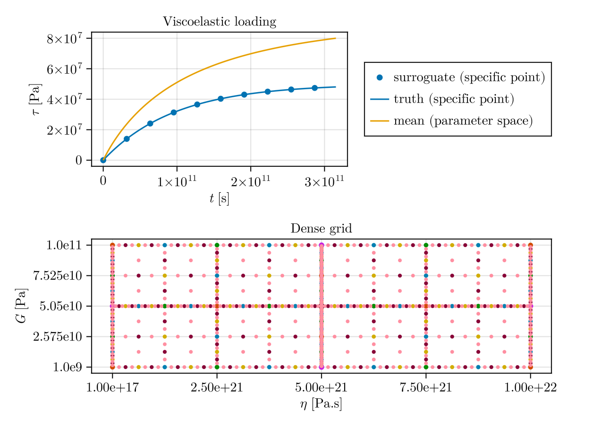
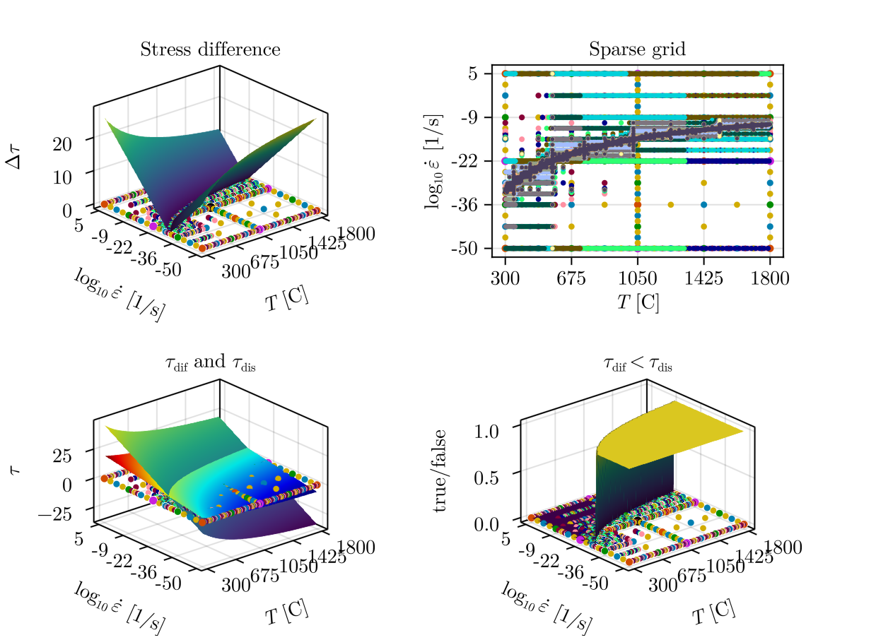

## Example usage of DistributedSparseGrids.jl

This repository aims to provide a few examples of how sparse grids can be employed to:

- create surroguate models
- refine a specific region in parameter space
- uncertainties, distributions, probability maps

### Example 1) Maxwell viscoelasticity

This example illustrates how the package can be used to evaluate a function at a large number of points, without performing any adaptive refinement. Here the forward model is a simple viscoelastic analytical solution for stress build-up. The two varied parameters are viscosity and shear modulus.

The resulting basis functions enable interpolation throughout the parameter space, allowing model outputs to be generated for parameter combinations that were not explicitly evaluated during the sampling process.

### Example 2) Diffusion/dislocation creep transition

This example illustrates the use of adaptive refinement to accurately capture a localized feature in parameter space. We use a rheological model for olivine that incorporates both diffusion and dislocation creep mechanisms. The refinement procedure is applied to resolve the boundary between the two deformation regimes in a two-dimensional parameter space spanned by temperature and the logarithm of strain rate.

